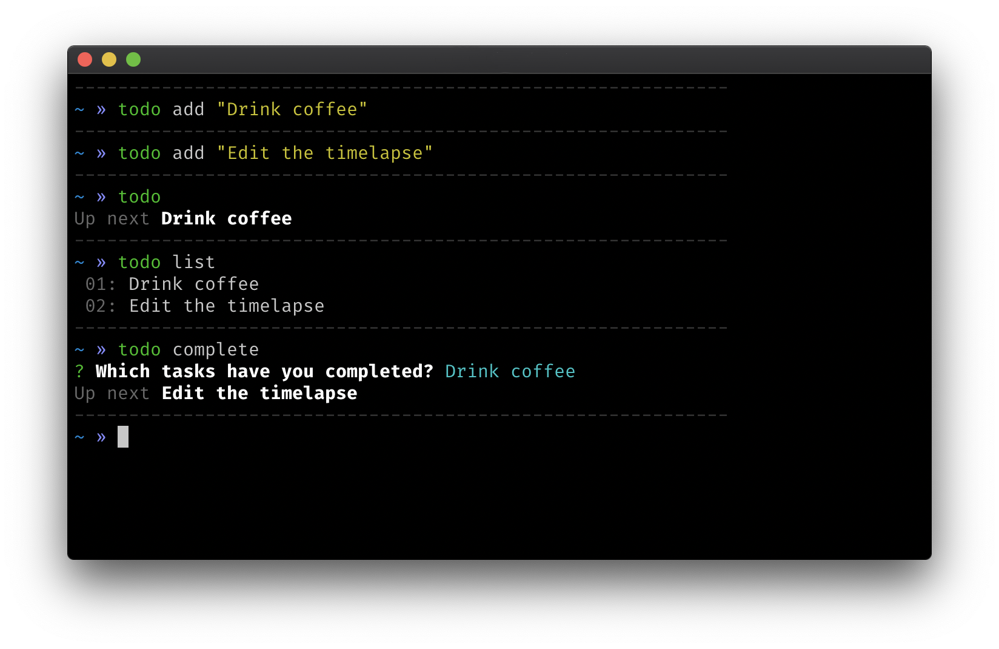

# @relekang/todo

> Just another todo cli.



## Installation

```
npm i -g @relekang/todo
```

## Usage

```
$ todo help
-------------------------- todo --------------------------

Commands:
add       - Add a new todo
list      - List all todos
next      - Get info about what to do next
pri       - Prioritise all the things
complete  - Mark tasks as completed
```
