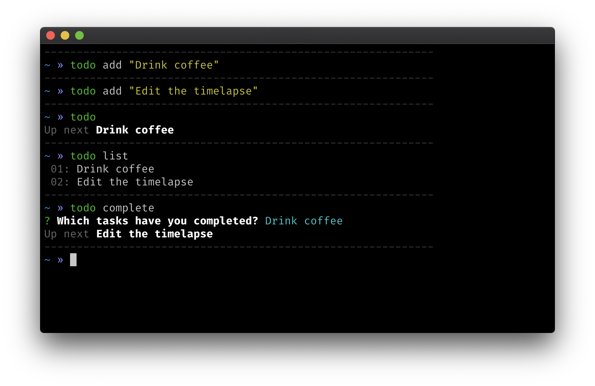

# @relekang/todo

> Just another todo cli.



## Installation

```
npm i -g @relekang/todo
```

### Development

This repo contains multiple packages handled by lerna. To setup the repo run:

```shell
yarn
lerna bootstrap
git config alias.exec '!exec ' # This is used to run tests and linting from packages
```
